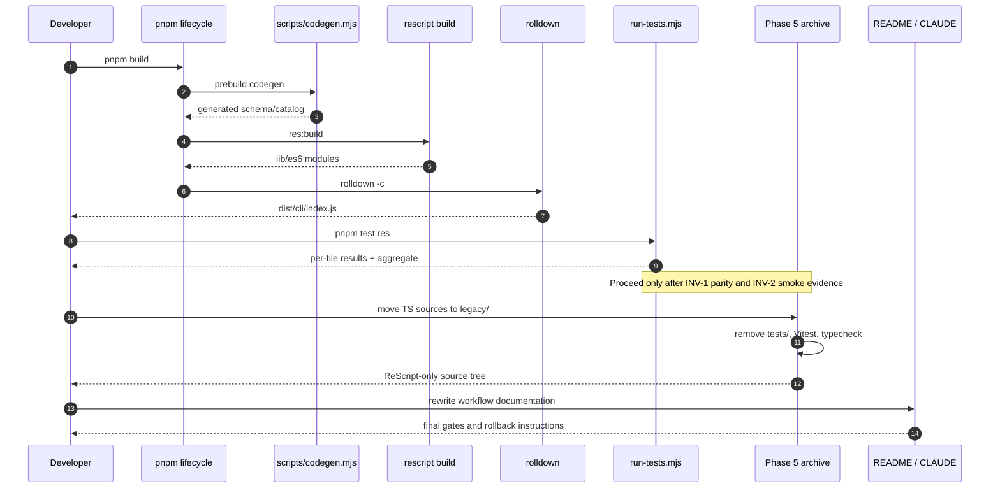

# Design: ReScript Production Cutover

## Technical Approach

Make phases 1–4 additive: introduce a deterministic asset generator and a Node child-process runner while Vitest remains green (**INV-1**). After parity is proven, phase 5 archives the dead TypeScript tree, removes Vitest, and makes ReScript the only production/test source. The production flow remains `codegen → rescript build → rolldown`; generated modules contain assets at build time, so the shipped CLI has no new runtime I/O and preserves **INV-2**.

## Component Breakdown

### `build-pipeline`

| Path | Action | Phase / responsibility |
|---|---|---|
| `package.json` | Modify | Add lifecycle graph; switch `test` and remove `typecheck` in phase 5. |
| `.gitignore` | Modify | Ignore the two generated `.res` modules. |
| `scripts/codegen.mjs` | Create | Codegen preflight (shared with `asset-codegen`). |
| `scripts/run-tests.mjs` | Create | ReScript aggregate test command (shared with `test-runner`). |
| `README.md`, `CLAUDE.md` | Modify | Document the ReScript/rolldown workflow in phase 6. |
| `rolldown.config.ts`, `rescript.json` | No change | Existing Bootstrap entry and compiler settings are already correct. |

### `test-runner`

| Path | Action | Phase / responsibility |
|---|---|---|
| `scripts/run-tests.mjs` | Create | Discover compiled `*Tests.res.mjs` and `*.test.res.mjs`, spawn children, aggregate results. |
| `src/architecture/{BuildScript,CheckSecrets,DomainPurity,ResiCoverage,Scaffold,TypeSafetyGuards}Tests.res` | Create | Port the six applicable architecture guards in phase 2. `vitest-thresholds` and `domain.parity` are intentionally moot. |
| `src/**/**/*Tests.res`, `src/**/*.test.res` | Create/modify | Phase-3 unit and integration parity gaps; preserve existing ReScript test semantics. |
| `tests/**/*.ts` (44 files) | Delete | Phase 5 only, after side-by-side parity. |
| `vitest.config.ts` | Delete | Phase 5 only. |

### `asset-codegen`

| Path | Action | Phase / responsibility |
|---|---|---|
| `schemas/quotas.schema.json` | No change | Canonical schema input. |
| `src/i18n/locales/en.json` | No change | Canonical English catalog input. |
| `src/Infra/ConfigLoader.Schema.res` | Create, generated/ignored | `%raw` schema module. |
| `src/i18n/Translator.EnCatalog.res` | Create, generated/ignored | `Dict.fromArray` catalog module. |
| `src/Infra/ConfigLoader.res` | Modify | Import generated `schema`; remove the inline literal. |
| `src/i18n/Translator.res` | Modify | Import generated `enCatalog`; remove the inline tuples. |

Phase-5 archive moves the current tracked TypeScript set from `src/{cli,domain,ports,adapters,rendering,application,i18n}/` to the identical relative paths under `legacy/`. Preflight found **46** files (the proposal's “45” is an estimate); the move must be generated from the tracked set and verified. `legacy/` is committed, not ignored.

## Seven-Phase Rollout

1. Add `scripts/run-tests.mjs` and `pnpm test:res`; leave Vitest as `pnpm test`.
2. Port the six architecture guards to ReScript tests; keep all existing suites.
3. Fill unit/integration parity gaps and run both runners side-by-side.
4. Add asset codegen, lifecycle hooks, generated-module consumers, and drift checks.
5. After parity evidence, archive the 46 TypeScript sources, remove Vitest/tests/typecheck, and switch `test` to the runner.
6. Rewrite `README.md` and `CLAUDE.md` for the ReScript-only workflow and `legacy/` archive.
7. Run final build, test, CLI-smoke, secret-leak, generated-drift, and archive-integrity gates.

## Architecture Decisions

| Decision | Choice | Alternatives rejected | Rationale |
|---|---|---|---|
| Asset delivery | Build-time generated ReScript modules | `@module` JSON; runtime `fs` | Avoids brittle `lib/` relative paths and runtime files not shipped; keeps one canonical source and zero runtime I/O. |
| Test isolation | `spawn("node", [testPath], {stdio: "inherit"})` | In-process imports; buffered/pass-through-only execution | Each compiled test owns `process.exit`; inherited output preserves useful failures and avoids module-state leakage. |
| Runner aggregation | Sequential, run-all-then-report | Fail-fast; default parallelism | Stable output and complete failure attribution outweigh failure-path speed. An opt-in bounded `--parallel[=N]` may be added for local speed. |
| Cutover safety | Archive TS; delete tests only after parity | Immediate deletion; keep dual implementations | Reversible source history is retained while INV-1 makes phase 5 evidence-based. |
| Coverage | Remove Vitest thresholds; revisit with `bisect_ppx` later | Block cutover on unsupported ReScript coverage | Coverage instrumentation is explicitly out of scope; pass/fail parity is the current gate. |

## Data Flow

```text
canonical JSON ──read/parse/sort──> codegen ──write──> generated .res
                                                          │
                                                          v
                 ConfigLoader.res / Translator.res ──> rescript build
                                                          │
                                                          v
                                             rolldown ──> dist/cli/index.js

lib/es6 test modules ──glob──> run-tests.mjs ──spawn──> Node child processes
                                                        │
                                                        └──> aggregate exit code
```

## `scripts/codegen.mjs` — Internal Design

Resolve the repository root from the script URL, then use `readFileSync(path, "utf8") → JSON.parse`. Recursively sort object keys (arrays retain order), serialize with `JSON.stringify(value, null, 2) + "\n"`, and write only when bytes differ. This makes repeated runs byte-identical and timestamp-free.

The schema emitter has this exact shape:

```js
const escaped = json
  .replaceAll("\\", "\\\\") // preserve JSON escape sequences in a template literal
  .replaceAll("`", "\\`")
  .replaceAll("$", "\\$");   // prevents `${...}` interpolation
const source = `// generated by scripts/codegen.mjs — do not edit
let schema: JSON.t = %raw(\`${escaped}\`)
`;
```

The locale emitter sorts `Object.entries(locale)` by key and emits:

```rescript
// generated by scripts/codegen.mjs — do not edit
let enCatalog: dict<string> = Dict.fromArray([
  ("header.bar", "Bar"),
  ("status.OK", "OK"),
])
```

Tuple strings use JSON/ReScript-compatible string escaping. The generated module contracts are `schema: JSON.t` and `enCatalog: dict<string>`; consumers reference those modules rather than duplicating values.

After generation, the script extracts the `%raw(\`...\`)` payload with a delimiter-aware scanner, reverses only the generator's backtick/dollar/backslash escapes (never `eval`), parses it, canonicalizes it, and deep-compares it with the canonical schema. `--check` performs the same round-trip plus byte comparison without writing, so stale, missing, malformed, or manually edited generated files produce drift. Exit codes are: `0` success, `1` drift/round-trip mismatch, `2` canonical read/parse, directory, or write failure.

## `scripts/run-tests.mjs` — Internal Design

Walk `lib/es6/` with Node 18-compatible `readdirSync(..., {withFileTypes: true})`; the logical glob inputs are exactly `lib/es6/**/*Tests.res.mjs` and `lib/es6/**/*.test.res.mjs`. Deduplicate, normalize to absolute paths, and sort lexicographically. Zero matches prints a warning and exits `1` (never a silent pass).

Default execution is sequential. For each file, spawn `node` with `{cwd: PROJECT_ROOT, stdio: "inherit"}` and arm a 30-second timeout. `RES_TEST_TIMEOUT_MS` overrides the default; timeout sends `SIGTERM`, escalates after a short grace period, and records `TIMEOUT`. Spawn errors, signals, non-zero exits, and timeouts are failures. The runner executes all files before reporting:

```text
PASS lib/es6/src/domain/Aggregation.test.res.mjs
FAIL lib/es6/src/Infra/ConfigLoaderTests.res.mjs (exit 1)
ReScript tests: 2 files, 1 passed, 1 failed
```

The final exit is `0` only when every child exits `0`; otherwise it is non-zero and identifies every failed file. An optional bounded `--parallel=N` can trade clean inherited output for speed; it is not used by package scripts.

## Build Pipeline Integration

The intended `package.json` graph is:

```json
{
  "codegen": "node scripts/codegen.mjs",
  "prebuild": "pnpm run codegen && pnpm run res:build",
  "preres:build": "pnpm run codegen",
  "postinstall": "pnpm run codegen",
  "res:build": "rescript build",
  "build": "rolldown -c",
  "test:res": "node scripts/run-tests.mjs",
  "test": "node scripts/run-tests.mjs"
}
```

The `test` replacement is applied only in phase 5; through phase 4 it remains `vitest run` (**INV-1**). `test:watch`, `test:coverage`, and `typecheck` are removed in phase 5. `prebuild` intentionally calls `res:build` and its `preres:build` hook may invoke idempotent codegen a second time; this keeps both direct entry points safe. Add `src/Infra/ConfigLoader.Schema.res` and `src/i18n/Translator.EnCatalog.res` to `.gitignore`.

## Phase-5 TS Archive

Move every tracked file matching `src/**/*.ts` in the seven named source areas to `legacy/` while preserving its relative path. Then delete `tests/` and `vitest.config.ts`. Remove `vitest`, `@vitest/coverage-v8`, `@vitest/ui` and `ts-node` when present (the current manifest has no `@vitest/ui` or `ts-node`), remove `typescript` once `tsconfig.json` has no consumer, and retain `@types/node` if needed by the remaining Node-facing tool configuration. Update `pnpm-lock.yaml` through the package-manager command. This is the irreversible boundary; a revert restores the TS tree, tests, config, and package graph.

## Phase-5 Sequence



## Work-Unit Commits

Each unit carries its focused test, runtime harness result, and independent rollback boundary. The tasks phase must count authored additions plus deletions; generated ignored output is excluded from the 400-line authored budget.

- **WU-1**: Add `scripts/codegen.mjs`, its script-level/round-trip tests, and locally generated outputs; no package wiring.
- **WU-2**: Wire codegen lifecycle hooks, `.gitignore`, and generated-module imports; verify no inline asset remains.
- **WU-3**: Add `scripts/run-tests.mjs` and `test:res`; prove both Vitest and ReScript runner are green.
- **WU-4a**: Port the six architecture guards.
- **WU-4b**: Port unit parity gaps and uncertain-parity module tests.
- **WU-4c**: Port the three integration tests and record the parity receipt. WU-4a–c are chained if any slice crosses 400 lines.
- **WU-5**: Move the verified 46-file TS set to `legacy/`; build and both runners remain green.
- **WU-6a**: Remove Vitest/typecheck scripts and dependencies; switch `test` after parity.
- **WU-6b+**: Delete `tests/` in separately counted architecture, unit, and integration/characterization slices; remove `vitest.config.ts` and `tsconfig.json` only when their consumers are gone.
- **WU-7**: Rewrite `README.md` and `CLAUDE.md`, then run final gates.

**Decision needed before apply: Yes** (the tasks phase must resolve the exact deletion slices). **Chained PRs recommended: Yes. 400-line budget risk: High**, primarily for test migration/deletion and the archive snapshot.

## Interfaces / Contracts

- `codegen.mjs`: `node scripts/codegen.mjs [--check]`; `0` success, `1` drift, `2` I/O/parse failure.
- `ConfigLoader.Schema`: exports `schema: JSON.t`.
- `Translator.EnCatalog`: exports `enCatalog: dict<string>`.
- `run-tests.mjs`: discovers the two required suffix patterns, prints one result per file plus totals, and returns non-zero for zero files or any child failure.
- Package lifecycle: `pnpm build` is fail-fast; no later stage runs after codegen or ReScript failure.

## Validation Strategy

| Phase | Required gates | Do-not-regress guarantee |
|---|---|---|
| 1 | `pnpm res:build`, `pnpm test:res`, `pnpm test`, `pnpm typecheck` | Existing Vitest suite remains green. |
| 2–3 | Both runners, typecheck, focused build, architecture/parity tests | Every previously passing test remains runnable; no deletion. |
| 4 | Two codegen runs, `node scripts/codegen.mjs --check`, both runners, typecheck, `pnpm build`, CLI help, secret gate | Generated modules reproduce inline behavior; Vitest remains the behavior gate. |
| 5 | `pnpm res:build`, `pnpm test`, `pnpm build`, CLI help, `bash scripts/check-secrets.sh` | ReScript runner replaces Vitest only after the parity receipt; **INV-2** remains unchanged. |
| 6–7 | Full final build/test/smoke/secret gates and documentation review | No provider, renderer, schema, locale, or CLI behavior change. |

## Threat Matrix

| Boundary | Applicability | Safe/failure behavior and planned RED tests |
|---|---|---|
| Documentation-like paths | N/A — only compiled `.res.mjs` suffixes are executable test inputs; Markdown and README-like paths are never classified as tests. | No test required by the matrix. |
| Git repository selection | N/A — no git command or repository-path selection is automated. | No test required. |
| Commit state | N/A — work-unit guidance does not execute staging/commit operations. | No test required. |
| Push state | N/A — no push or ref resolution is performed. | No test required. |
| PR commands | N/A — no PR automation is part of the change. | No test required. |
| Child-process execution | Applicable — use argument-array `spawn`, inherited stdio, per-child exit capture, and timeout termination; never shell interpolation. RED tests cover pass, non-zero/crash, signal, timeout, zero files, and summary attribution. | Safe: all files run and are reported. Failure: aggregate is non-zero and names the file. |
| Package lifecycle/process order | Applicable — hooks must produce codegen before `rescript build`, and fail-fast must prevent rolldown after a failed compiler. RED tests cover hook order and failure short-circuiting. | Safe: `codegen → res:build → rolldown`; failure: later stage is not invoked. |

## Risks and Mitigations

- **Parity gap between Vitest and ReScript runner:** run both in phases 1–4; phase 5 is blocked by any Vitest failure.
- **Generated-file drift:** deterministic sorted-key output, `--check`, and schema round-trip comparison.
- **Lost coverage thresholds:** explicit out-of-scope decision; track `bisect_ppx` as a future change rather than pretending pass/fail is coverage.
- **Brittle `@module` JSON alternative:** intentionally not chosen because of the four-segment `lib/` path and bundler sensitivity; runtime `fs` is also rejected because `en.json` is not shipped to the runtime bundle.
- **Archive-count mismatch:** use the tracked-file manifest (currently 46), not the proposal estimate, and verify `legacy/` preserves every relative path.
- **Published-package postinstall:** validate the package artifact in the tasks/verify phase because the current `files` list omits development `scripts/` and ReScript sources; do not let a local bootstrap hook break a published install.

## Explicit Non-Changes

- `dist/cli/index.js` observable behavior remains bit-equivalent for the same inputs under **INV-2**: same flags, render output, and exit codes.
- Existing ReScript test semantics and production provider/domain/rendering behavior are preserved.
- Canonical schema and locale values do not change; only their generated module location changes.
- Secret-leak gates, including `bash scripts/check-secrets.sh`, continue to run.
- No CI, lint/format tool, ETTL wiring, or provider web scraping is introduced.

## Migration / Rollout

Additive phases 1–4 are independently reversible. Phase 5 is one guarded cutover boundary, with source archival before Vitest deletion and a `git revert` rollback path. No data migration or feature flag is required.

## Open Questions

- [ ] Tasks phase must finalize counter-based WU-4/WU-6 chained slices and record the parity receipt before apply.
- [ ] Verify whether the published package should ship codegen inputs or use a source-tree guard for `postinstall`; this does not affect the local checkout flow.
